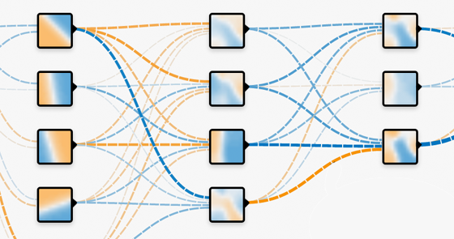

# Neural Network Playground — Extended Edition

An interactive, browser-based visualization of feedforward neural networks, built on top of the original [Google / TensorFlow Neural Network Playground](https://playground.tensorflow.org). This fork extends it with a large set of additional features covering modern training techniques, adversarial robustness, machine unlearning, fine-tuning, 3D datasets, and two standalone advanced labs.



---

## Features at a Glance

### Core Training
- **Activation functions** — ReLU, Tanh, Sigmoid, Linear, Sine, Sinc, Mish, GELU, Leaky ReLU, PReLU
- **Optimizers** — SGD, Momentum, RMSProp, Adam (all with per-parameter state)
- **Regularization** — L1 and L2 with adjustable rate
- **Weight quantization** — 16-bit, 8-bit, 4-bit, 2-bit simulation
- **Layer normalization** — optional per hidden layer
- **Configurable batch size, learning rate, noise, train/test split**

### Datasets
- **Classification (2D)** — Circle, XOR, Two Gaussians, Spiral, Concentric Circles, Biclusters, Moons, Hash, MNIST-Three
- **Regression (2D)** — Plane, Gaussian, Sine Wave, Maximum, ArgMax, Friedman 1/2/3
- **Custom CSV** — paste or upload your own `x,y,label` data
- **3D datasets** — Gaussian blobs, Concentric spheres, Double helix, Swiss roll (rendered with three.js)

### Input Feature Engineering
Toggle derived features: x, y, x², y², x·y, sin(x), sin(y), atan2(y,x), ‖(x,y)‖, |x−y|−3, |x+y|−3

### Metrics and Visualization
- Live **training/test loss** line chart
- **Accuracy** readout for train and test sets
- **Confusion matrix** updated every epoch
- Decision boundary **heatmap** (100×100 grid, canvas-rendered)
- Per-node **heatmaps** showing each hidden node's activation surface

### Advanced Features
- **Adversarial sampling** — FGSM and PGD attacks with configurable epsilon; optionally mixed into training batches (defensive adversarial training)
- **Machine unlearning** — gradient-ascent forgetting on a selected subset while preserving retained-set accuracy; retrain-from-scratch baseline
- **Fine-tuning** — freeze/unfreeze individual hidden layers; export trained model to JSON; import a previously saved model
- **Model export/import** — download network weights and configuration as JSON, re-load them later

### Separate Advanced Labs
- **`dist/cnn.html`** — from-scratch CNN visualizer (convolutional layers, filters, feature maps)
- **`dist/transformer.html`** — attention-mechanism visualizer (multi-head self-attention)

---

## Getting Started Locally

```bash
# 1. Install dependencies
npm install

# 2. Build the main playground
npm run build

# 3. Serve from the dist/ directory (opens http://localhost:3000)
npm run serve
```

For a fast edit-refresh cycle during development:

```bash
npm run serve-watch
```

This starts a live server and recompiles TypeScript, HTML, and CSS whenever a source file changes.

To also build the CNN and Transformer labs:

```bash
npm run build-all
```

---

## Running Tests

### Unit tests (Jest)

```bash
npm test
```

### End-to-end tests (Playwright)

```bash
npm run test:e2e
```

---

## Deployment

### Cloudflare Pages (recommended)

| Setting | Value |
|---|---|
| Build command | `npm run build-all` |
| Output directory | `dist` |
| Environment variable | `NODE_VERSION=22` |

### Wrangler direct upload

```bash
npx wrangler pages deploy dist --project-name <your-project-name>
```

---

## Architecture Overview

All source files live in `src/`. Compiled output goes to `dist/`.

| Module | Role |
|---|---|
| `nn.ts` | Core ML engine: `Node`, `Link`, `buildNetwork`, `forwardProp`, `backProp`, `updateWeights`. Defines all activation functions, optimizers, regularizers, and weight quantizers. |
| `playground.ts` | Main UI: wires the D3-based network diagram, heatmaps, line chart, and all controls to the `nn.ts` engine. Entry point for `dist/bundle.js`. |
| `state.ts` | URL-hash-serializable application state (`State` class). Contains the `activations`, `optimizers`, `datasets`, and `regDatasets` registration maps. |
| `heatmap.ts` | Canvas-based `HeatMap` class; renders the decision boundary and per-node activation thumbnails. |
| `linechart.ts` | SVG `AppendingLineChart`; streams train/test loss over epochs. |
| `dataset.ts` | All 2D dataset generators (`DataGenerator` type). |
| `dataset3d.ts` | 3D dataset generators (`DataGenerator3D` type): blobs, spheres, helix, Swiss roll. |
| `threeview.ts` | `ThreeView` class; wraps a three.js WebGL scene for the 3D data visualizer. Drag-to-rotate, scroll-to-zoom. |
| `adversarial.ts` | FGSM and PGD attack functions; `inputGradients` helper for propagating loss back to raw x/y inputs. |
| `unlearning.ts` | `forgetPoints` (gradient-ascent forgetting) and `retrainWithout` (retrain-from-scratch baseline). |
| `customdataset.ts` | CSV parser/serializer (`parseCSV`, `serializeCSV`, `trainTestSplit`) for user-supplied datasets. |
| `cnn.ts` | Standalone CNN lab entry point. |
| `transformer.ts` | Standalone transformer lab entry point. |

---

## Credits

Original [TensorFlow Neural Network Playground](https://github.com/tensorflow/playground) by **Google / TensorFlow team**. Extended by **David Cato**. Additional features, labs, and this documentation by **Mohit Burkule** (mohit@fruitcast.co.uk).

This project is licensed under the Apache 2.0 License — see [LICENSE](LICENSE).
